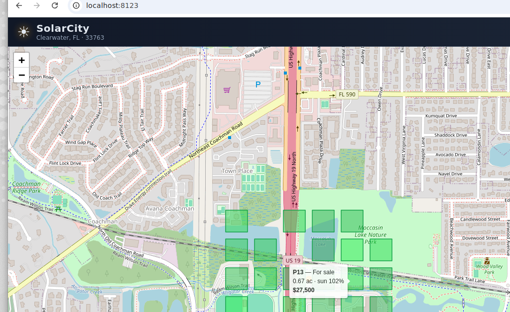

# SolarCity — a solar tycoon game for a real zip code

SimCity-style city builder, but for solar power on real land. Pick plots of
land for sale on an interactive map of a real zip code, install solar panels and
batteries, and grow your clean-energy empire month over month on a budget.

**Default location:** Clearwater, FL — zip `33763`.



## Gameplay

1. **Buy land** — click a green *For Sale* plot on the map and purchase it.
   Each plot has a size (acres), a sun-quality rating, a panel capacity, and a
   price.
2. **Build** — install solar panels (multiple tiers) and batteries on plots you
   own. Plots fill up visually as you add panels.
3. **Advance the month** — press *Advance Month* to simulate energy production,
   sell power to the grid, pay upkeep, and collect your monthly investment
   budget.
4. **Grow & level up** — reinvest your budget, raise total capacity to unlock
   better panels/batteries, complete goals for bonus cash, and climb from
   *Rooftop Rookie* to *Sun Baron*.

### What makes it a game

- **Monthly budget loop** — a fixed monthly allowance plus energy revenue,
  minus maintenance, funds your expansion. Spend wisely.
- **Seasonal simulation** — production uses real-ish monthly peak-sun-hours for
  the Tampa Bay area, so winter months yield less.
- **Batteries matter** — without storage, some midday overproduction is
  curtailed; adding batteries raises the share of energy you can actually sell.
- **Goals, levels & score** — one-time goals award cash, capacity milestones
  unlock gear, and a score tracks lifetime CO₂ offset + revenue + capacity.

## Run it

It's a fully static site — no build step.

```bash
cd solar-city
python3 -m http.server 8000
# open http://localhost:8000
```

Leaflet is vendored locally under `vendor/leaflet/`, so the only thing that
needs an internet connection is the map tiles (served by OpenStreetMap).

## Change the zip code

Edit `js/data.js` and update `CONFIG.zip`, `CONFIG.cityName`, and
`CONFIG.center` (lat/lng). Land plots are generated deterministically from the
zip, and `CONFIG.peakSunHours` can be tuned for the local climate.

## Project structure

```
index.html      layout + HUD
styles.css      dark, game-like UI styling
js/data.js      config & catalogs (panels, batteries, levels, goals)
js/game.js      game state + month-by-month simulation engine
js/map.js       Leaflet map + land-parcel rendering
js/ui.js        DOM rendering & interaction wiring
js/main.js      bootstrap
```

## Tech

Vanilla JavaScript, [Leaflet](https://leafletjs.com/) for the interactive map,
and OpenStreetMap tiles. No framework, no build tooling.
